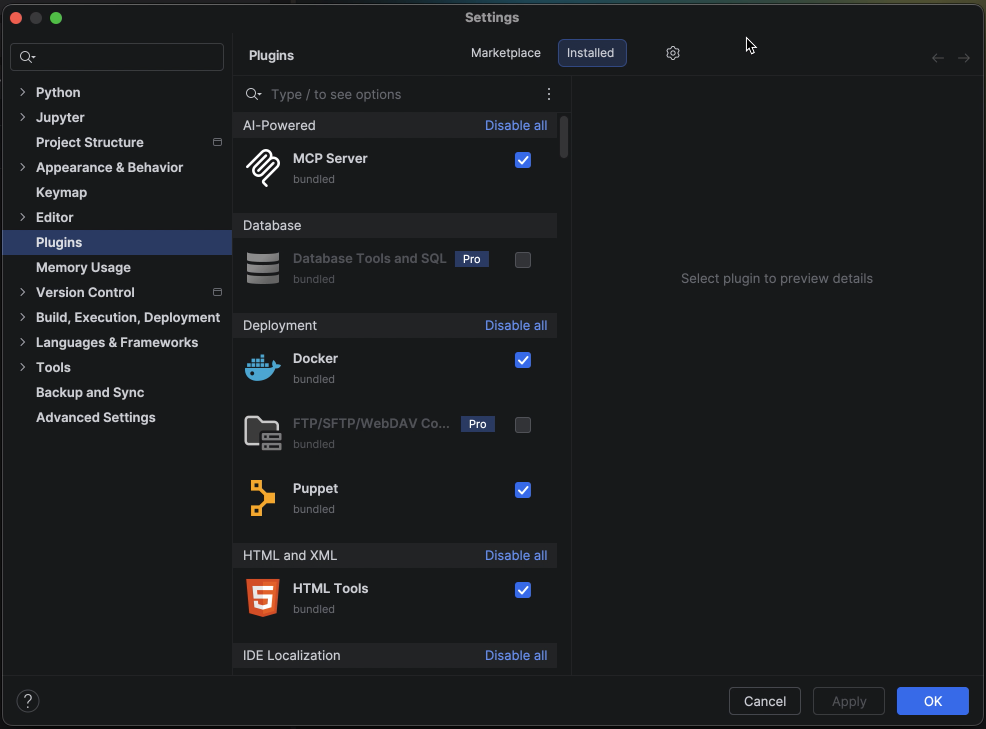
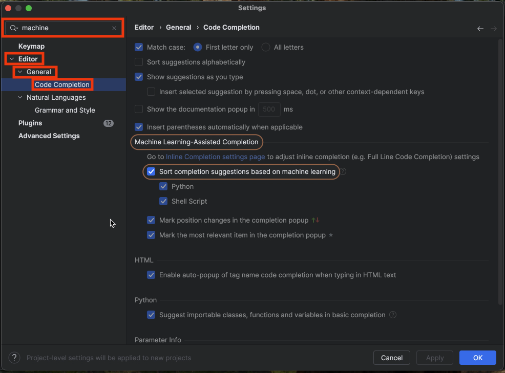
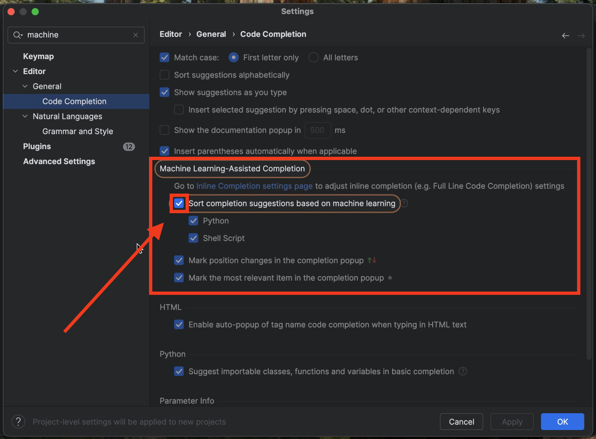
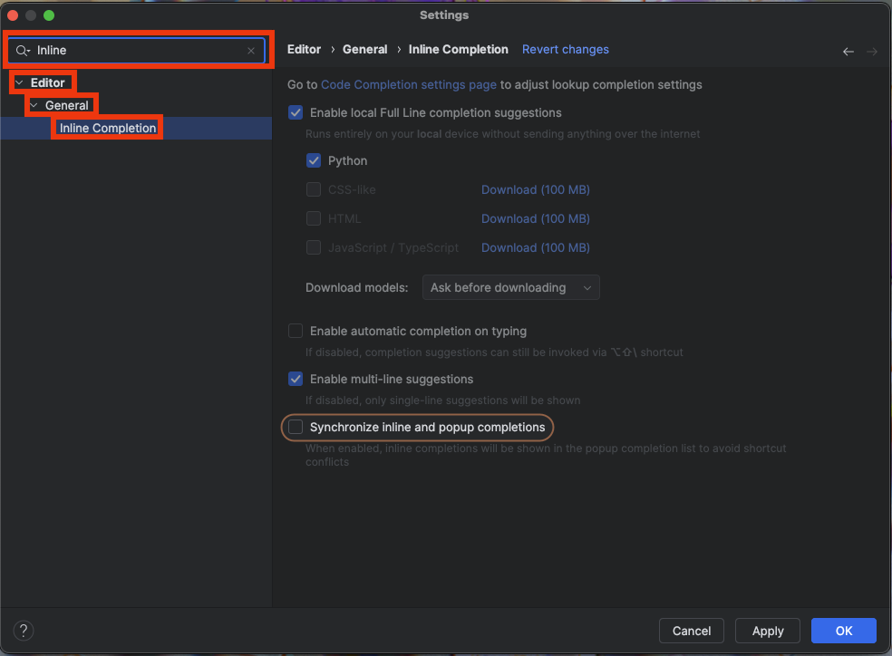
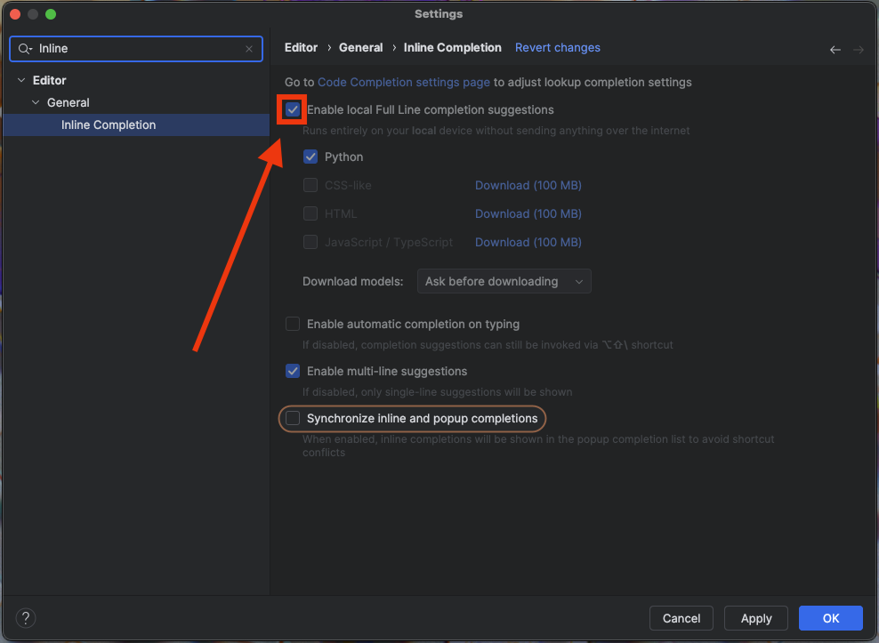
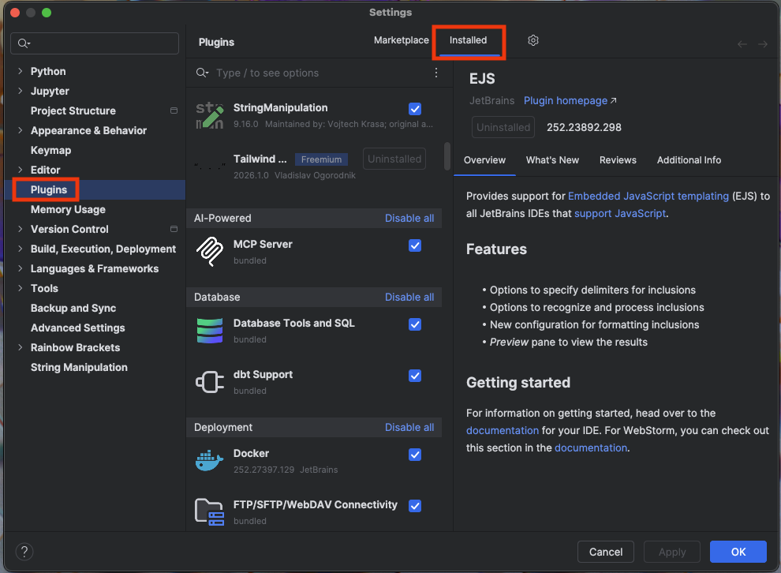
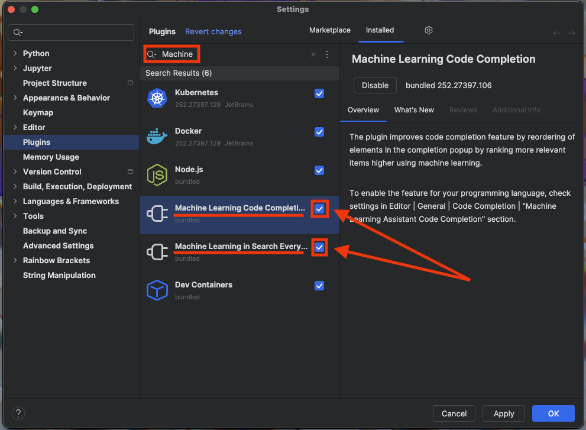
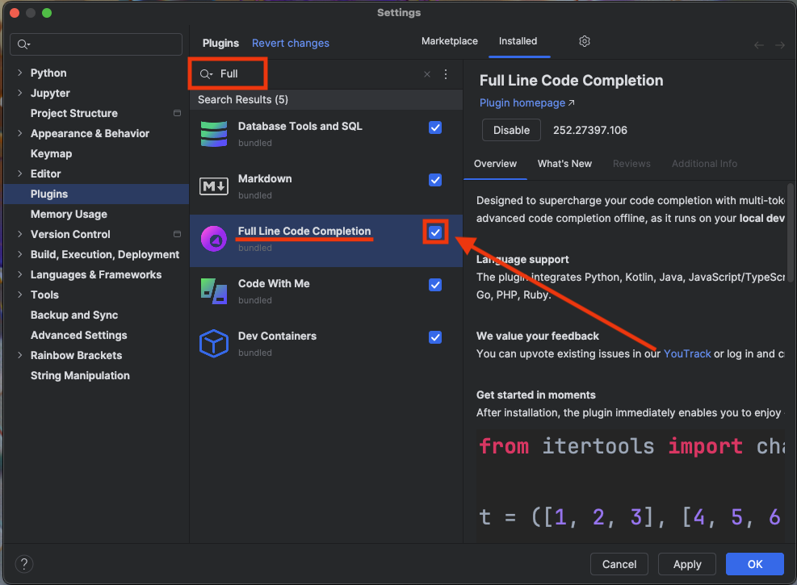

# Disabling AI

## Overview
AI can be a powerful tool for programmers, and is often preinstalled and enabled by default in applications.
A fresh installation of PyCharm comes with some of these basic tools and features already enabled. 
A requirement for the COMP 1510 course at DTC, is for all AI coding assistance tools to be disabled in PyCharm.
This guide provides step-by-step instructions on what specific setting are needed to be disabled.

!!! danger "Danger - Course Requirements May Differ"

    The requirements for which AI settings are to be disabled are determined by the instructor of the COMP 1510 course.
    They may be different than what is displayed in this guide or could change at a moments notice. 
    It is the reader's responsibility to ensure that their IDE's AI setting follow the specific requirements set by the
    instructor over following this guide.

### Parts of This Guide:
1. Opening the Settings Menu,
2. Disabling AI Code Completion,
3. Disabling AI Inline Completion,
4. Disabling Bundled AI and Machine Learning Plugins

!!! warning "Warning - Steps Must be Followed in Order"

    If these steps and sections are not followed in the specified order, the options offered in the menus may change. 
    This may lead to impropperly disabled settings. This issue could also occur if any of these setting are not in their
    default state before beginning this guide. If you are unable to access a setting, please follow [the troubleshooting guide](troubleshooting.md).

---

## Opening the Settings Menu

There are multiple ways to access the settings menu in PyCharm, however this method should be available to you while you
are accessing almost any part of the application.

1. **Focus** the PyCharm window.
2. **Click** on the [small gear] icon in the top right corner of the application. 
: 
: If you are on the "Welcome to PyCharm Page", the icon may be located in the bottom left corner depending on your theme style.
: 

3. **Click** on [Settings...] in the drop-down menu.
: 
: By default, the specific settings page that was last open will reopen. You can click on the various options in the left panel of the menu window to open, expand, or collapse them.
: 

!!! success "Success"

    The settings menu has been successfully opened. Continue with the "Disabling AI Inline Completion" section.

??? note "Note - Settings Menu Shortcut"

    The default keyboard shortcut to open the settings menu on Windows is: `Ctrl + Alt + s`.  
    On macOS it is: `Cmd + ,`.

---

## Disabling AI Code Completion

These steps will assume that the user has the settings window of PyCharm already open. If you do not, please follow the instructions outlined in "Opening the Settings Menu".

1. **Select** the search bar at the top of the left side of the menu window.
2. **Type** `Machine`. When you do so, the available options in the left panel of the menu should drastically decrease.
3. **Select**: [Editor] > [General] > [Code Completion] in the left panel. 
: 
: This will open a new page on the right side of the menu window. 

4. **Unselect** the checkbox beside "[Sort completion suggestions based on machine learning]" under the "Machine Learning-Assisted Completion" header on the "Code Completion" page that we have just opened.
: 
: The rest of the options on this page should become grayed out immediately.

    ??? note "Note - Highlighted Options"

        Because we have used the search feature, the menu has already highlighted the section and checkbox we are
        looking for. This will happen anytime the search is used to locate a setting.

!!! success "Success"

    AI Code Completion has been succuessfully disabled. Continue with the "Disabling AI Inline Completion" section.

---

## Disabling AI Inline Completion

These steps will assume that the user has the settings window of PyCharm already open. If you do not, please follow the instructions outlined in "Opening the Settings Menu".

1. **Select** the search bar at the top of the left side of the menu window.
2. **Type** in `Inline`. When you do so, the available options in the left panel of the menu should drastically decrease.
3. **Select** [Editor] > [General] > [Inline Completion] in the left panel. 
: 
: This will open a new page on the right side of the menu window.

4. **Unselect** "Enable local Full Line completion suggestions" on the "Inline Completion" page that we have just 
opened. 
: 
: The rest of the options on this page should become grayed out immediately.

    ??? note "Note - Highlighted Options"
    
        Because we have used the search feature, the menu has already highlighted the section and checkbox we are 
        looking for. This will happen anytime the search is used to locate a setting.

!!! success "Success"

    AI Inline Completion has been succuessfully disabled. Continue with the "Disabling Bundled AI and Machine Learning 
    Plugins" section.

---

## Disabling Bundled AI and Machine Learning Plugins

These steps will assume that the user has the settings window of PyCharm already open. If you do not, please follow the
instructions outlined in "Opening the Settings Menu".

1. **Select** [Plugins] from the left panel s. This will open a new page on the right side of the menu window.

    ??? note "Note - Difficulty Finding the Plugins Option"

        If you are having difficulty locating the plugins option, minimize the dropdown menus located in the left 
        portion of the settings window. The "Plugins" option is located at the highest level and is unable to be
        minimized.

2. **Select** [Installed] at the top of the "Plugins" page that we have just opened.
: 

3. **Type** `Machine` in the [search bar] above the list of plugins.
4. **Uncheck** the checkboxes beside the following plugins:
    * [Machine Learning Code Completion]
    * [Machine Learning in Search Everywhere]
: 
: When a plugin has been disabled it will be grayed out and the checkbox will be empty.

5. **Type** `Full` in the [search bar] above the list of plugins.
6. **Uncheck** the boxes beside the following plugins:
    * [Full Line Code Completion]
: 
: When a plugin has been disabled it will be grayed out and the checkbox will be empty.

!!! danger "Danger - Bundled Plugins May Differ"

    The plugins that come preinstalled in PyCharm may be different than the ones mentioned in this guide in the 
    future. Please ensure you follow your instructor's requirements of which plugins to disable.

---

## Conclusion

If you followed all the previous steps in order, you will have successfully disabled the AI tools that are required to
be disabled for COMP 1510, and are ready to move on to Linking a GitHub Account. If you were unable to locate any of the
options, please follow the [troubleshooting guide](troubleshooting.md).