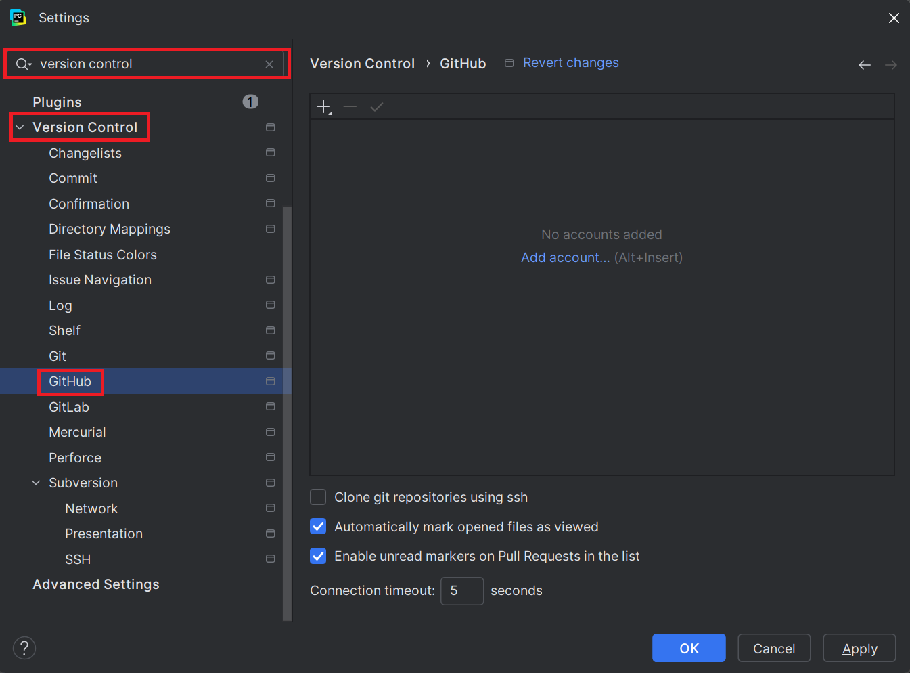
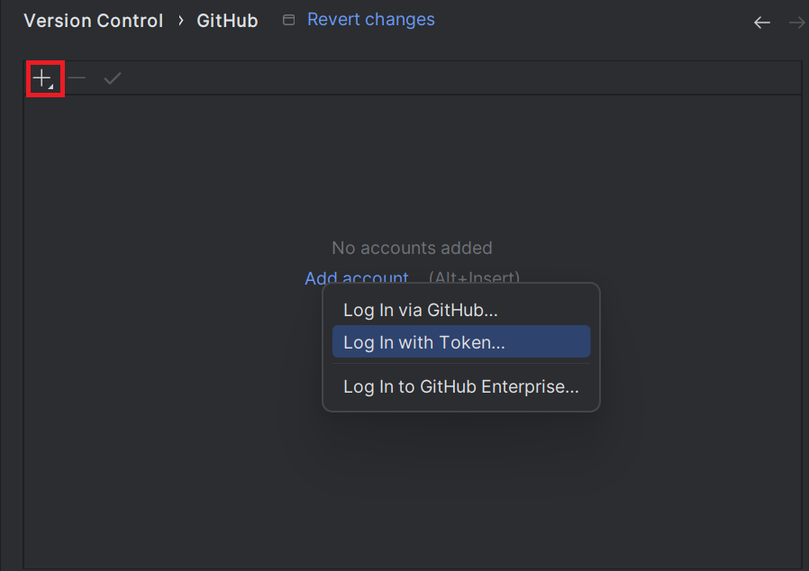
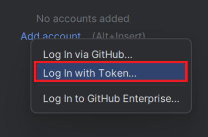
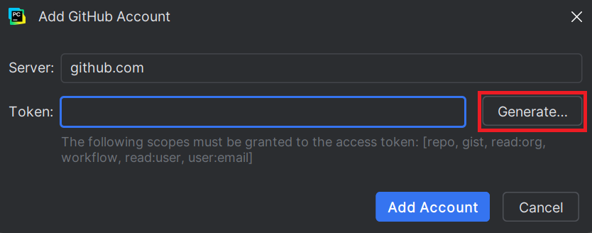
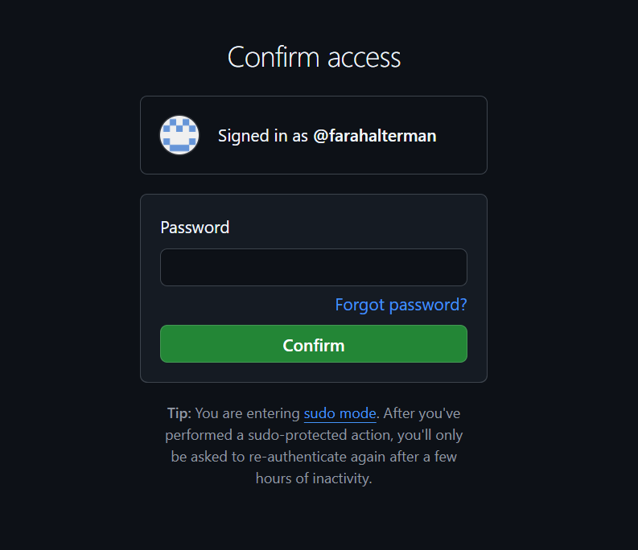
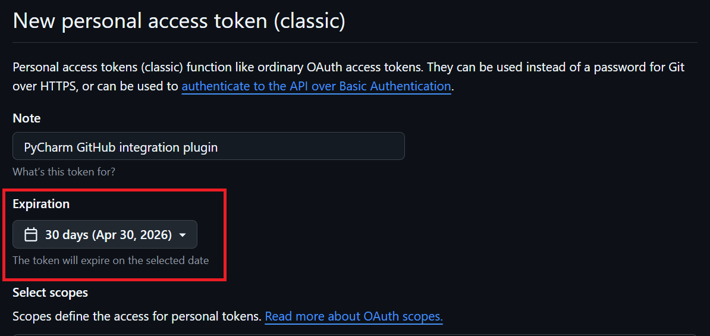
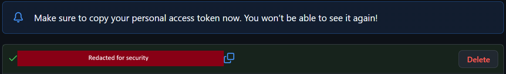

# Linking a GitHub Account

## Overview

In this section, you will learn how to link your GitHub account to PyCharm. This will allow you to
clone GitHub repositories, push and pull changes, and work on a codebase collaboratively with others.

??? question "New to GitHub?"

    GitHub is a version control platform. Version control allows you to take a snapshot of your project, so that you have a record
    of what your project has looked like every step of the way. This also allows you to return to the previous version of a project.  

    Commonly used terms include the following:  

    **Repository**: A place to store files and code  
    **Clone**: Creates a local copy of a GitHub repository  
    **Push**: Updates GitHub repository to match the local copy  
    **Pull**: Updates local copy to match the GitHub repository

---

## Generating a token

1. **Open** the settings menu 
:  Refer to [Opening the Settings Menu](Disabling_AI.md#opening-the-settings-menu) for detailed steps to open the settings menu.
2. **Type** `version control` into the search bar
3. **Click** [Version Control] > [GitHub] on the left side menu
:     
4. **Click** [+] in the top left corner of the menu
:    
   After clicking [+], a selection box will popup.
5. **Click** [Log In with Token]  
     
   This will cause the popup window "Add GitHub Account" to appear.
6. **Click** [Generate]
:    
   This will open GitHub on your preferred browser.
7. **Confirm** access to GitHub by entering your password
:    
:   It is assumed you are already [logged into your GitHub account](https://GitHub.com/login).
8. **Set** your token expiry date to 4 months (default 30 days)
:    

    !!! warning "Warning - Token Expiry and Safety"

        The shorter the token life, the more secure it will be.  
        If someone gains access to your token, this will affect the integrity of your GitHub account.
        We recommend setting your token for a custom amount of approximately 4 months (ie. until the end of the semester).
        If choosing a shorter expiry, make sure that the expiration date does not line up with your midterm or final, as 
        generating a new token during your exam will lead to unneccesary stress.

9. **Check** all checkboxes and **click** [Generate Token] at the bottom of the page
10. **Copy** the generated token
:   
11. **Switch** back to PyCharm and paste your token
12. **Click** [Add Account]

---

## Conclusion

If you followed all the previous steps in order, you will have successfully linked your GitHub to Pycharm, and are ready to move on to [Syncing Settings Across JetBrains IDEs](Syncing_IDE_Settings.md). If you were unable to locate any of the options, please refer to the [Troubleshooting](troubleshooting.md) section for help.
